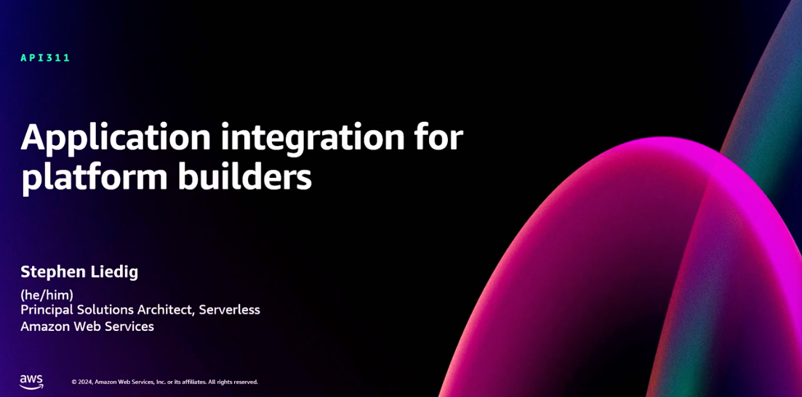
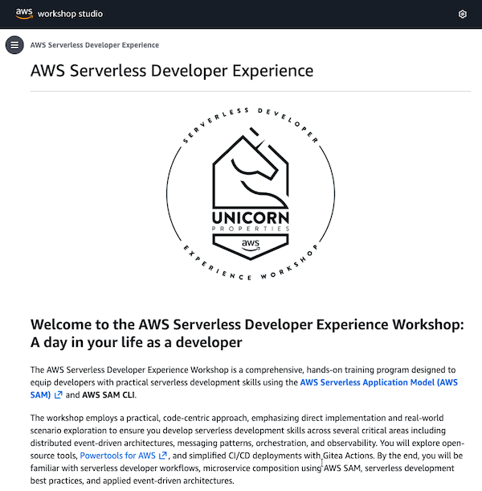

# Amazon EventBridge resource policy samples

[Amazon EventBridge](https://aws.amazon.com/eventbridge) resource policies that make it easier to build applications that work across accounts. Resource policies provide you with a powerful mechanism for modeling your event buses across multiple accounts, and give you fine-grained control over EventBridge API invocations.

This repository contains sample implementations for Amazon EventBridge resource policies.

## 1. E-commerce example walk-through

This sample application walks you through how to use Amazon EventBridge resource policies as presented in [feature release blog post](https://aws.amazon.com/blogs/compute/simplifying-cross-account-access-with-amazon-eventbridge-resource-policies)

**[Get started with the e-commerce sample >](blog/README.md)**

## 2. Multi-account design patterns

The samples in this section provide sample implementations using **"single-bus, multi-account"**, and **"multi-bus, multi-account"** patterns as presented in the AWS re:Invent 2020 session [Building event-driven applications with Amazon EventBridge](https://youtu.be/Wk0FoXTUEjo?si=kjAU7viCA9qLkom2) which is available on-demand on YouTube.

**[Explore all the multi-account design patterns >](patterns/README.md)**

## 3. Resources

### Videos

For more on this topic, check out these re:Invent recordings:

#### [Building event-driven applications with Amazon EventBridge](https://youtu.be/Wk0FoXTUEjo?si=kjAU7viCA9qLkom2)

More and more companies are looking at event-driven architecture and Amazon EventBridge to help with application modernization. Amazon EventBridge is helping them build loosely coupled applications that scale independently and make it easier to integrate cloud-based applications and services. But where do you start? This session covers event-driven design concepts, outlines how to deal with Amazon EventBridge event bus topologies and multi-account patterns, and presents recommended practices for building scalable event-driven applications using Amazon EventBridge

#### [Designing event-driven integrations using Amazon EventBridge](https://youtu.be/W3Rh70jG-LM?si=J0ycgmcqWFKbpyv8)

Event-driven architecture can bring alignment to an organization’s business capabilities. Amazon EventBridge enables application integration across business applications and improves modern application development practices. In this session, learn about the roles and responsibilities of stakeholder groups and discover foundational concepts for designing and building a sustainable, scalable, serverless event bus for your organization.

#### [Application integration for platform builders](https://youtu.be/4lejvOd42_M?si=UiulkXSIj69FF_hN)

Modern distributed applications leverage diverse integration components such as queues, event brokers, and workflows. To enhance developer productivity and enforce best practices, platform architects automate the management of these components, incorporating robust logging, monitoring, and security measures. In this session, explore the implementation of application integration using serverless components in enterprise environments. Gain insights on implementing effective data masking techniques, establishing comprehensive observability, and securely configuring cross-account access, and learn how to design and maintain scalable, secure distributed systems that align with enterprise-grade standards.

### Workshops

#### [AWS Serverless Developer Experience](https://catalog.workshops.aws/serverless-developer-experience/en-US)

The AWS Serverless Developer Experience Workshop is a comprehensive, hands-on training program designed to equip developers with practical serverless development skills using the AWS Serverless Application Model (AWS SAM)  and AWS SAM CLI.

The workshop employs a practical, code-centric approach, emphasizing direct implementation and real-world scenario exploration to ensure you develop serverless development skills across several critical areas including distributed event-driven architectures, messaging patterns, orchestration, and observability. You will explore open-source tools, Powertools for AWS , and simplified CI/CD deployments with Gitea Actions. By the end, you will be familiar with serverless developer workflows, microservice composition using AWS SAM, serverless development best practices, and applied event-driven architectures.

### Additional resources

For more serverless learning resources, visit [Serverless Land](https://serverlessland.com/).

## Security

See [CONTRIBUTING](CONTRIBUTING.md#security-issue-notifications) for more information.

## License

This library is licensed under the MIT-0 License. See the LICENSE file.

Copyright Amazon.com, Inc. or its affiliates. All Rights Reserved.

SPDX-License-Identifier: MIT-0
