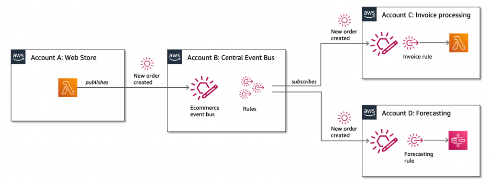

# Simplifying cross-account access with Amazon EventBridge resource policies

> **For more details on the implementation visit the [accompanying AWS blog post](https://aws.amazon.com/blogs/compute/simplifying-cross-account-access-with-amazon-eventbridge-resource-policies)**

In this ecommerce example, there are multiple services distributed across different accounts. A web store publishes an event when a new order is created. The event is sent via a central event bus, which is in another account. The bus has two rules with target services in different AWS accounts.



The goal is to create fine-grained permissions that only allow:

* The web store to publish events for a specific detail-type and source.
* The invoice processing service to create and manage its own rules on the central bus.

To complete this walk through, you set up three accounts. For account A (Web Store), you deploy an [AWS Lambda](https://aws.amazon.com/lambda) function that sends the `newOrderCreated` event directly to the `central event bus` in account B. The invoice processing Lambda function in account C creates a rule on the central event bus to process the event published by account A.

## Requirements

* AWS CLI already configured with Administrator permission
* [AWS SAM CLI installed](https://docs.aws.amazon.com/serverless-application-model/latest/developerguide/serverless-sam-cli-install.html)

## Installation Instructions

1. [Create 3 AWS accounts](https://portal.aws.amazon.com/gp/aws/developer/registration/index.html) if you do not already have them and login.

2. Clone the repo onto your local development machine:

``` bash
git clone https://github.com/aws-samples/amazon-eventbridge-resource-policy-samples
```

## Getting started

To get started follow the instructions on [deploying the central event bus to account B](blog/account-b-central-bus/README.md)

## Next Steps

The AWS Compute Blog series and video link at the top of this README file contains additional information about the application design and architecture.

If you have any questions, please contact the author or raise an issue in the GitHub repo.