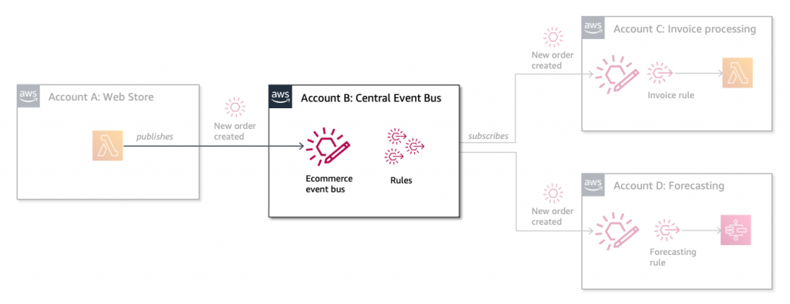

# Deploy the central event bus in account B

This template creates the Central event bus in account B. **Make sure you deploy this first, before any other applications.**



For more details on the implementation visit the accompanying AWS blog post ["Simplifying cross-account access with Amazon EventBridge resource policies"](https://aws.amazon.com/blogs/compute/simplifying-cross-account-access-with-amazon-eventbridge-resource-policies)


## Deploy the application

To install simply create a new stack via the [AWS CloudFormation Console](https://console.aws.amazon.com/cloudformation/home) or via the AWS CLI below (make sure to substitute your account details).

The template takes three parameters:

* **EventBusName:** Name of the central event bus
* **AccountA:** Account number for account A
* **AccountC:** Account number for account C


``` bash
aws cloudformation create-stack /
    --stack-name central-event-bus /
    --template-body file://template.yaml /
    --parameters ParameterKey=AccountA,ParameterValue=111111111111 ParameterKey=AccountC,ParameterValue=2222222222222
```
