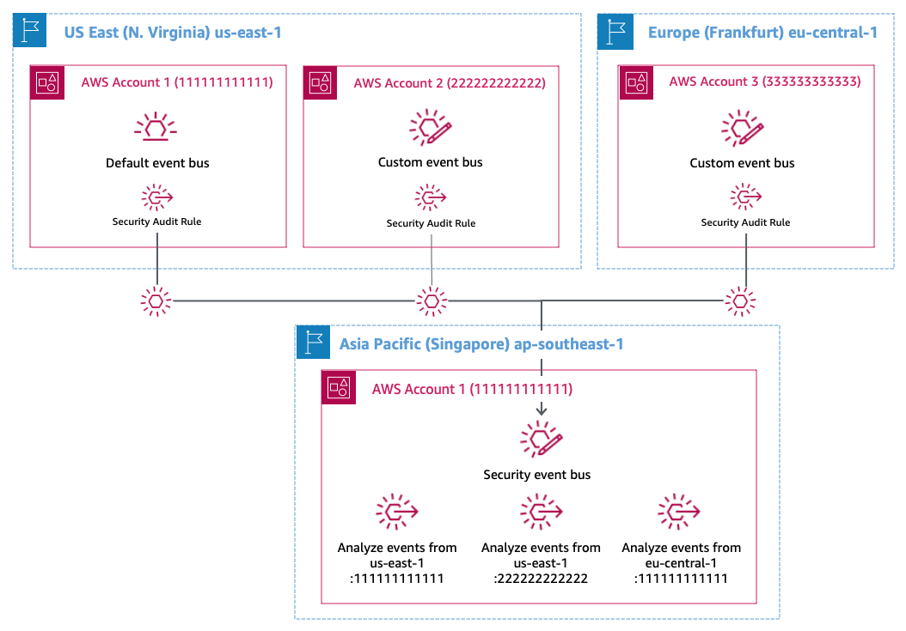
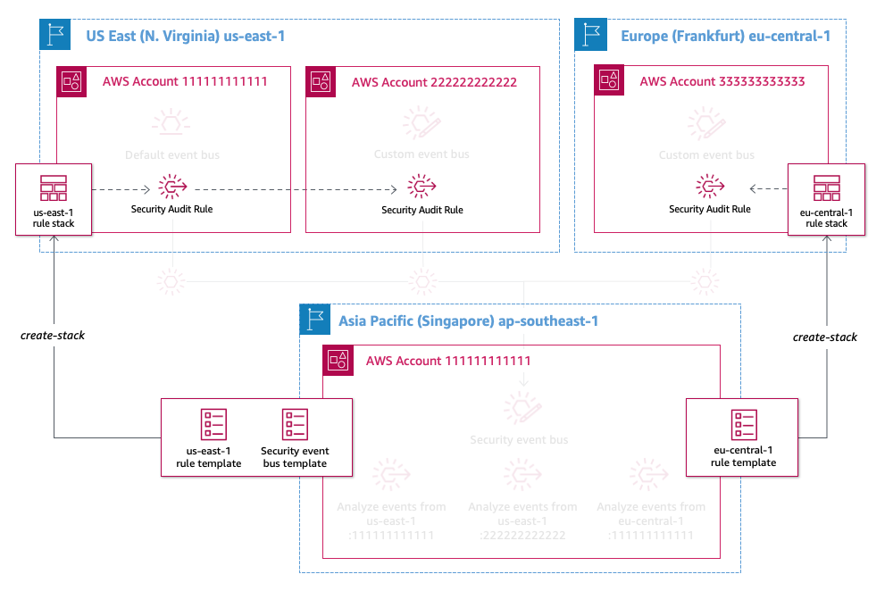

# Cross-region event routing with Amazon EventBridge

In this scenario, a company has their base of operations located in Asia Pacific (Singapore) with applications distributed across two additional Regions in US East (N. Virginia) and Europe (Frankfurt).  The applications in US East (N. Virginia) and Europe (Frankfurt) are using Amazon EventBridge for their respective applications and services.  The security team in Asia Pacific (Singapore) wishes to analyze events from the respective applications as well as receive AWS CloudTrail events for specific API calls made to specific operations to monitor infrastructure security.



## Setup

This sample uses the Serverless Application Model Command Line Interface (AWS SAM CLI). To use the AWS SAM CLI, you need the following tools.

* AWS SAM CLI - [Install the AWS SAM CLI](https://docs.aws.amazon.com/serverless-application-model/latest/developerguide/serverless-sam-cli-install.html)
* [Python 3 installed](https://www.python.org/downloads/)
* Docker - [Install Docker community edition](https://hub.docker.com/search/?type=edition&offering=community)

To run this demo you need to have to have access to three AWS accounts. The account numbers in the demo map to:

* account_1 -> your first account number (used for the security event bus in region ap-southeast-1, and the default event bus in region us-east-1)
* account_2 -> your second account number (used for the custom event bus in account 2)
* account_3 -> your thirst account number (used for the custom event bus in account 3)

Create AWS CLI Profiles for these accounts. For information on how to create named profiles visit <https://docs.aws.amazon.com/cli/latest/userguide/cli-configure-profiles.html>

Once you have the profiles created open the `Makefile` and replace the variables at the top of the file with your profile names

```Makefile
# Add your profile names here
PROFILE1        := "profile_for_account_1"
PROFILE2       	:= "profile_for_account_2"
PROFILE3       	:= "profile_for_account_3"
```

Optionally you can pass these as parameters as required, for example:

```bash
make deploy-security-bus PROFILE1=default
```

## Step 1. Deploy applications accounts

The first step is to set up the event buses in the source "application" accounts. These are the accounts that will be publishing events to the security event bus in Singapore (ap-southeast-1). The following command will create an `AWS::Events::EventBusPolicy` on event buses in the three accounts. Remember to pass in the PROFILE names if you haven;t hard coded them into the make file.

```bash
make deploy-source SECURITY_ACCOUNT_NO=[account number mapped to account_1]
```

**IMPORTANT:** Record the ARN numbers of the event buses  that were just created in Account 2 (us-east-1) and 3 (eu-central-1), including the default event bus in Account 1 (us-east-1).

### Step 2. Deploy security event bus

```bash
make deploy-security-bus PROFILE1="profile_for_account_1"
```

### Step 3. Deploy the rules

Because you cannot create AWS CloudFormation resources across Regions you need to define the rules in separate templates – this also gives the ability to easily expand to other regions.  Once the template has been deployed to the cross-Region accounts, you can make use of the EventBridge resource policies to propagate rule definitions across account in the same Region.  Note, the security account needs to have permission to create CloudFormation resources in the cross-Region accounts to deploy the rule templates.



```bash
make deploy-rules PROFILE1=[profile_for_account_1] PROFILE3=[profile_for_account_3] SECURITYEVENTBUSARN=[ARN] EVENTBUSARNACCOUNT1=[ARN] EVENTBUSARNACCOUNT2=[ARN] EVENTBUSARNACCOUNT3=[ARN]
```

### Step 4. Test the rules

Navigate to the applications/account_2 directory.  Here you will find an events.json file which you will use as input for your put-events API call. Execute he following command using the AWS CLI. This will send messages to the event bus in us-east-1 which will be routed to the security event bus in Account 1 (ap-southeast-1). 

```bash
aws events put-events \
  --region us-east-1 \
  --profile [NAMED PROFILE FOR ACCOUNT 2] \
  --entries file://events.json
```

If you have executed this successfully, you should see output like this:

```bash
Entries:
- EventId: a423b35e-3df0-e5dc-b854-db9c42144fa2
- EventId: 5f22aea8-51ea-371f-7a5f-8300f1c93973
- EventId: 7279fa46-11a6-7495-d7bb-436e391cfcab
- EventId: b1e1ecc1-03f7-e3ef-9aa4-5ac3c8625cc7
- EventId: b68cea94-28e2-bfb9-7b1f-9b2c5089f430
- EventId: fc48a303-a1b2-bda8-8488-32daa5f809d8

FailedEntryCount: 0
```

Next, open your AWS Console you used to deploy the security event bus.  Navigate to AWS CloudWatch console you should see a collection of log entries with the events you just published Log Group for `/aws/events/SecurityAnalysisRule`