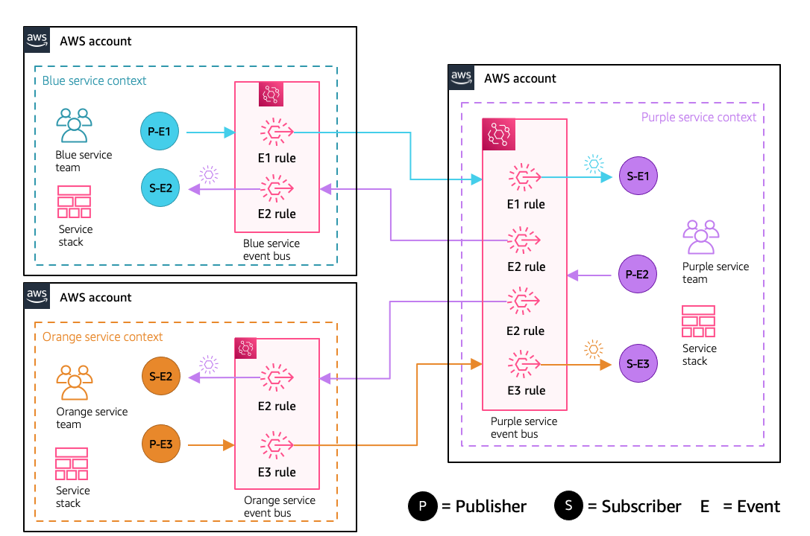

# Multi-bus, multi-account pattern



### Characteristics

- Each service team manages their own event bus
- No additional buses required to facilitate cross account event delivery
- Aligned to service boundary

### Team

- Service teams manage all resources for sending and receiving events

### Considerations

- Additional overhead in managing distributed rules and resource policies

## Installation Instructions

### Requirements

1. To run these samples in your own accounts you need to have the following tooling:

    - AWS CLI already configured with Administrator permission
    - [AWS SAM CLI installed](https://docs.aws.amazon.com/serverless-application-model/latest/developerguide/serverless-sam-cli-install.html)

2. [Create 3 AWS accounts](https://portal.aws.amazon.com/gp/aws/developer/registration/index.html) if you do not already have them and login

3. Clone this repo onto your local development machine:

``` bash
git clone https://github.com/aws-samples/amazon-eventbridge-resource-policy-samples
```

### Getting started

1. Make sure you have a reference to all the account number where you are going to deploy each of the service resources.
1. Navigate to the `patterns/multi-bus-multi-account-pattern` directory. There you will find the projects for each of the services and devops account.

    ``` bash
    .
    ├── README.md
    ├── blue-service-account
    │   └── blue-service-app
    │       ├── subscriptions.yaml      <-- Deploy the subscription templates after all the SAM templates
    │       └── template.yaml           <-- Deploy the SAM templates first
    ├── orange-service-account
    │   └── orange-service-app
    │       ├── subscriptions.yaml
    │       └── template.yaml
    └── purple-service-account
        └── purple-service-app
            ├── subscriptions.yaml
            └── template.yaml
    ```

1. Deploy each of the SAM templates (templates.yaml) in each of the folders to respective accounts. Navigate to one of the service apps folders and build and deploy the services using the SAM CLI commands

    ``` bash
    sam build
    ```

    then

    ``` bash
    sam deploy --guided
    ```

    walk through the guided deployment questions adding information about the account and service you are deploying. For example, here is how you could deploy the Blue service.

    ``` bash
    Setting default arguments for 'sam deploy'
    =========================================
    Stack Name [sam-app]: multi-bus-blue-service-apps
    AWS Region [us-east-1]:
    Parameter EventBusName [blue-service-event-bus]:
    Parameter PurpleServiceAccountNo []: arn:aws:events:ap-southeast-2:222222222222:event-bus/purple-service-event-bus-multi-bus
    Parameter OrangeServiceAccountNo []: arn:aws:events:ap-southeast-2:333333333333:event-bus/orange-service-event-bus-multi-bus
    #Shows you resources changes to be deployed and require a 'Y' to initiate deploy
    Confirm changes before deploy [y/N]:
    #SAM needs permission to be able to create roles to connect to the resources in your template
    Allow SAM CLI IAM role creation [Y/n]:
    Save arguments to configuration file [Y/n]:
    SAM configuration file [samconfig.toml]:
    SAM configuration environment [default]:
    ```

1. Follow the same process for the other services.

1. Once all of the Serverless applications have been deployed we can create our rules (subscriptions) on the event buses. You can create these in any order.

    Make sure you copy the output from all of your deployed Serverless applications. You will also need the ARN number of the Event buses that were created by the respective service stacks.

    ``` bash
    aws cloudformation describe-stacks --stack-name devops-event-bus --query 'Stacks[0]'.Outputs
    ```

1. Deploy the `subscription.yaml` files using the AWS CLI. Each service subscription has different parameter requirements. Here are some examples for each of the services.

    **Blue service subscriptions**

    ``` bash
    aws cloudformation create-stack --stack-name multi-bus-blue-service-apps-subscriptions /
        --template-body file://subscriptions.yaml /
        --capabilities CAPABILITY_IAM /
        --parameters ParameterKey=BlueServiceEventBusDlqUrl,ParameterValue=https://sqs.ap-southeast-2.amazonaws.com/111111111111/multi-bus-blue-service-apps-BlueServiceEventBusDlq-19RTU1Y6Y6QN3 ParameterKey=BlueServiceEventBusArn,ParameterValue=arn:aws:events:ap-southeast-2:111111111111:event-bus/blue-service-event-bus-multi-bus ParameterKey=BlueServiceEventBusDlqArn,ParameterValue=arn:aws:sqs:ap-southeast-2:111111111111:multi-bus-blue-service-apps-BlueServiceEventBusDlq-19RTU1Y6Y6QN3 ParameterKey=PurpleServiceEventBusArn,ParameterValue=arn:aws:events:ap-southeast-2:222222222222:event-bus/purple-service-event-bus-multi-bus
    ```

   **Purple service subscriptions**

    ``` bash
    aws cloudformation create-stack --stack-name multi-bus-purple-service-apps-subscriptions --template-body file://subscriptions.yaml --capabilities CAPABILITY_IAM --parameters ParameterKey=PurpleServiceEventBusArn,ParameterValue=arn:aws:events:ap-southeast-2:222222222222:event-bus/purple-service-event-bus-multi-bus ParameterKey=PurpleServiceEventBusDlqUrl,ParameterValue=https://sqs.ap-southeast-2.amazonaws.com/222222222222/multi-bus-purple-service-apps-PurpleServiceEventBusDlq-1BGYAG8PC3V4Q ParameterKey=PurpleServiceEventBusDlqArn,ParameterValue=arn:aws:sqs:ap-southeast-2:222222222222:multi-bus-purple-service-apps-PurpleServiceEventBusDlq-1BGYAG8PC3V4Q ParameterKey=BlueServiceEventBusArn,ParameterValue=arn:aws:events:ap-southeast-2:111111111111:event-bus/blue-service-event-bus-multi-bus ParameterKey=OrangeServiceEventBusArn,ParameterValue=arn:aws:events:ap-southeast-2:333333333333:event-bus/orange-service-event-bus-multi-bus
    ```

    **Orange service subscriptions**

    ``` bash
    aws cloudformation create-stack --stack-name multi-bus-orange-service-apps-subscriptions --template-body file://subscriptions.yaml --capabilities CAPABILITY_IAM --parameters ParameterKey=OrangeServiceEventBusArn,ParameterValue=arn:aws:events:ap-southeast-2:333333333333:event-bus/orange-service-event-bus-multi-bus ParameterKey=OrangeServiceEventBusDlqUrl,ParameterValue=https://sqs.ap-southeast-2.amazonaws.com/333333333333/multi-bus-orange-service-apps-OrangeServiceEventBusDlq-EGKF5KW7ZDI8 ParameterKey=OrangeServiceEventBusDlqArn,ParameterValue=arn:aws:sqs:ap-southeast-2:333333333333:multi-bus-orange-service-apps-OrangeServiceEventBusDlq-EGKF5KW7ZDI8 ParameterKey=PurpleServiceEventBusArn,ParameterValue=arn:aws:events:ap-southeast-2:222222222222:event-bus/purple-service-event-bus-multi-bus
    ```

