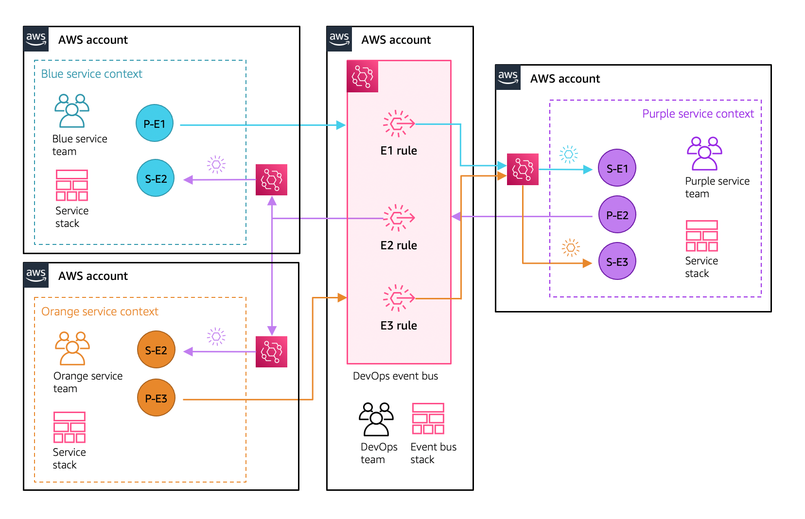

# Single-bus, multi-account pattern



## Characteristics

- Introduces the need for multiple event buses to transfer event between accounts
- Routing rules still via central bus
- Target rules migrate to service account event bus

### Team

- Service teams manage target configurations, but not routings

### Considerations

- Additional cross-account policy management (compared to single-bus, single account pattern)

## Installation Instructions

### Requirements

1. To run these samples in your own accounts you need to have the following tooling:

    - AWS CLI already configured with Administrator permission
    - [AWS SAM CLI installed](https://docs.aws.amazon.com/serverless-application-model/latest/developerguide/serverless-sam-cli-install.html)

2. [Create 4 AWS accounts](https://portal.aws.amazon.com/gp/aws/developer/registration/index.html) if you do not already have them and login

3. Clone this repo onto your local development machine:

``` bash
git clone https://github.com/aws-samples/amazon-eventbridge-resource-policy-samples
```

### Getting started

1. Make sure you have a reference to all the account number where you are going to deploy each of the service resources.
1. Navigate to the `patterns/single-bus-multi-account-pattern` directory. There you will find the projects for each of the services and devops account.

    ``` bash
    .
    ├── README.md
    ├── blue-service-account
    │   └── blue-service-app
    │       └── template.yaml
    ├── devops-account
    │   └── template.yaml
    ├── orange-service-account
    │   └── orange-service-app
    │       └── template.yaml
    └── purple-service-account
        └── purple-service-app
            └── template.yaml
    ```

1. Deploy DevOps account template, making sure to substitute your own account numbers

    ``` bash
    aws cloudformation create-stack //
        --stack-name devops-event-bus //
        --template-body file://template.yaml //
        --parameters ParameterKey=BlueServiceAccountNo,ParameterValue=[22222222222] ParameterKey=PurpleServiceAccountNo,ParameterValue=[333333333333] ParameterKey=OrangeServiceAccountNo,ParameterValue=[444444444444]
    ```

1. Get the ARN of the for the `DevOpsEventBusArn` key.

    ``` bash
    aws cloudformation describe-stacks --stack-name devops-event-bus --query 'Stacks[0]'.Outputs
    ```

1. Deploy the service accounts. This can be in any order. Navigate to one of the service apps folders and build and deploy the services using the AWS SAM CLI commands

    ``` bash
    sam build
    ```

    then

    ``` bash
    sam deploy --guided
    ```

    walk through the guided deployment questions adding information about the account and service you are deploying. For example, here is how you could deploy the Blue service.

    ``` bash
    Setting default arguments for 'sam deploy'
    =========================================
    Stack Name [sam-app]: single-bus-blue-service-apps
    AWS Region [us-east-1]:
    Parameter EventBusName [blue-service-event-bus]:
    Parameter DevOpsEventBusArn []: arn:aws:events:[AWS REGION]:222222222222:event-bus/devops-event-bus
    #Shows you resources changes to be deployed and require a 'Y' to initiate deploy
    Confirm changes before deploy [y/N]:
    #SAM needs permission to be able to create roles to connect to the resources in your template
    Allow SAM CLI IAM role creation [Y/n]:
    Save arguments to configuration file [Y/n]:
    SAM configuration file [samconfig.toml]:
    SAM configuration environment [default]:
    ```

1. Follow the same process for the other services.

### Starting the services

You can test the integrations by invoking the respective "publishing" functions.

1. Copy the the function names from the respective AWS Cloudformation stacks deployed across the service accounts.

    ``` bash
    aws cloudformation describe-stacks //
        --stack-name [single-bus-[COLOUR]-service-apps] 
        --query 'Stacks[0]'.Outputs
    ```

1. Invoke the functions

    **Blue Service Publisher E1**

    ```bash
    aws lambda invoke //
        --function-name [BlueServicePublisherE1] //
        --invocation-type Event //
        --payload "{}" out.txt //
        --region [AWS REGION]
        --profile [BLUE SERVICE PROFILE]
    ```

    **Purple Service Publisher E2**

    ```bash
    aws lambda invoke //
        --function-name [PurpleServicePublisherE2] //
        --invocation-type Event //
        --payload "{}" out.txt //
        --region [AWS REGION] //
        --profile [PURPLE SERVICE PROFILE]
    ```

    **Orange Service Publisher E3**

    ```bash
    aws lambda invoke //
        --function-name [OrangeServicePublisherE3] //
        --invocation-type Event //
        --payload "{}" out.txt //
        --region [AWS REGION] //
        --profile [ORANGE SERVICE PROFILE]
    ```

1. The subscriber functions log the event that they process to Amazon CloudWatch Logs. You can use AWS SAM CLI to view the log entrees that the subscriber function emit to their respective logs. Here are some example of how to do that.

    **Blue Service Subscriber E2**

    ```bash
    sam logs -t -n BlueServiceSubscriberE2 //
        --stack-name single-bus-blue-service-apps //
        --filter com.exampleCorp.PurpleService //
        --region [AWS REGION] //
        --profile [BLUE SERVICE PROFILE]
    ```

    **Purple Service Subscriber E1 & E3**

    ```bash
    sam logs -t -n PurpleServiceSubscriberE1 //
        --stack-name single-bus-purple-service-apps //
        --filter com.exampleCorp.BlueService //
        --region [AWS REGION] //
        --profile [PURPLE SERVICE PROFILE]
    ```

    ```bash
    sam logs -t -n PurpleServiceSubscriberE3 //
        --stack-name single-bus-purple-service-apps //
        --filter com.exampleCorp.OrangeService //
        --region [AWS REGION] //
        --profile [PURPLE SERVICE PROFILE]
    ```

    **Orange Service Subscriber E2**

    ```bash
    sam logs -t -n OrangeServiceSubscriberE2 //
        --stack-name single-bus-orange-service-apps //
        --filter com.exampleCorp.PurpleService //
        --region [AWS REGION] //
        --profile [ORANGE SERVICE PROFILE]
    ```
